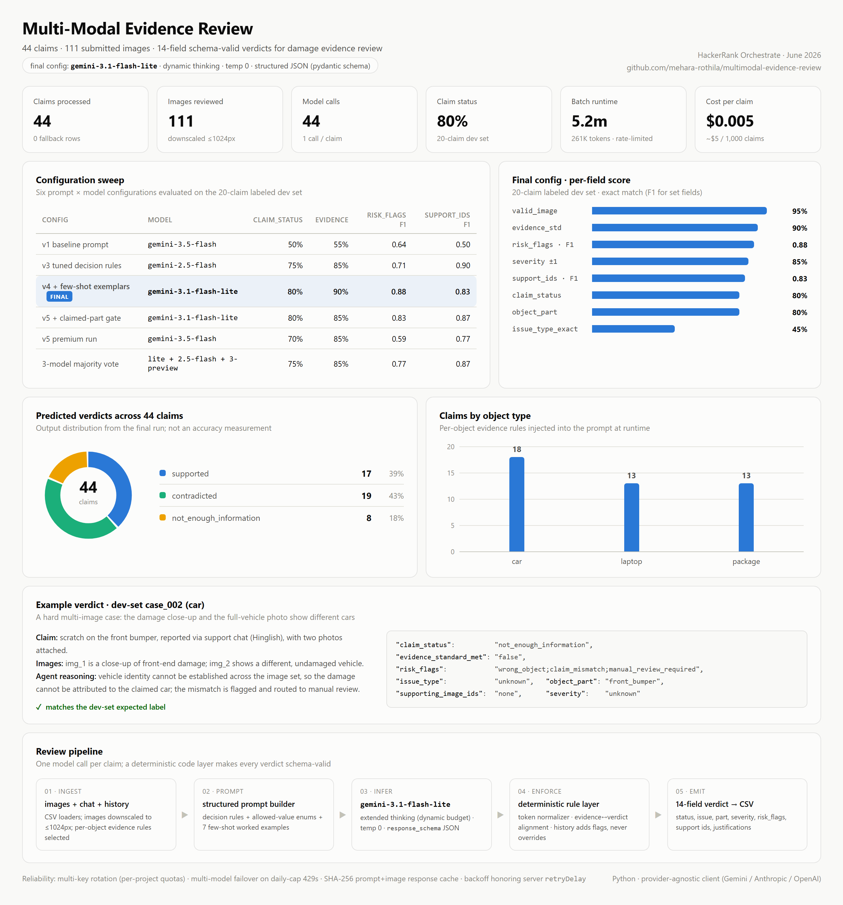

<div align="center">

# Multi-Modal Evidence Review
### VLM Damage-Claim Agent

*An AI agent that verifies insurance-style damage claims (car, laptop, package) from*
*submitted photos, a short claim conversation, user claim history, and a minimum-evidence checklist.*

Built for the **HackerRank Orchestrate** AI hackathon (June 2026)

</div>

---

For each claim it decides whether the images **support** the claim, **contradict** it, or
give **not_enough_information**, and produces a full structured verdict (issue type, object
part, severity, risk flags, supporting image IDs, and image-grounded justifications).

**Core principle:** the **images are the source of truth**. The conversation only defines
*what* to check, and user history only *adds risk context*; it never overrides what the
photos clearly show.

<p align="center">
  
</p>

---

## How it works

```
claims + images + user_history + evidence_requirements
        │
   data loaders → prompt builder → Vision-Language Model (Gemini + thinking)
        │                              ↑ rate-limit · cache · multi-key · multi-model failover
        │                              ↓ structured JSON
   reviewer: normalize to legal tokens → align evidence↔verdict
           → deterministic history rules (no override) → safe per-claim fallback
        │
   output.csv  (strict 14-column schema)
```

A vision-language model does the perception and reasoning behind a structured
prompt; a **deterministic post-processing layer** then guarantees every output
value is legal and applies the history/risk rules in code - so the model can't
emit an invalid label, and history can never flip a clear visual verdict.

## Highlights

- **Multimodal pipeline** - images + chat + history → structured JSON verdict with
  full field set and image-grounded justifications.
- **Evaluation-driven** - per-field accuracy, set-F1, and a confusion-matrix
  harness on a labeled gold set; **6 prompt/model configurations A/B-tested**, and
  the best-scoring one shipped.
- **A finding worth noting** - a *larger* model (Gemini 3.5-flash) scored *lower*
  than a calibrated lighter model: it over-reasoned and over-flagged relative to
  the conservative labels. On this task, **decision-rule calibration beat raw model
  size** - chosen by data, not by hype.
- **Quota-aware reliability** - multi-API-key rotation across projects,
  multi-model failover on daily-quota limits, rate limiting, retries that honor
  the server's `retryDelay`, and on-disk response caching. Runs a 44-claim batch on
  a free tier capped at 20 requests/day/model.
- **Provider-agnostic** - one client supports Gemini / Anthropic / OpenAI; switch
  with two env vars.

## Quickstart

```bash
cd code
python -m venv .venv
.venv/Scripts/python -m pip install -r requirements.txt   # Windows
# source .venv/bin/activate && pip install -r requirements.txt   # macOS/Linux

cp .env.example .env        # set EVIDENCE_PROVIDER + your API key
python main.py              # claims.csv -> output.csv
python evaluation/main.py   # metrics on the labeled sample set
```

> The competition dataset (`dataset/`) is **not** included in this repo. Point the
> paths in `code/config.py` at your own `claims.csv` / images. The input/output
> column schema and all allowed values live in `code/agent/schema.py`.

## Repo layout

```
code/
├── main.py                 # entry point: claims.csv -> output.csv
├── config.py               # paths, model/provider, keys, runtime knobs
├── agent/                  # schema · data · prompt · vlm · cache · reviewer · runner
├── evaluation/             # metrics, harness, and evaluation_report.md
└── scripts/                # model probe, smoke test
```

See [`code/evaluation/evaluation_report.md`](code/evaluation/evaluation_report.md)
for the metrics, the 6-config comparison, and the cost/latency/rate-limit analysis.

## Tech

Python · Google Gemini (vision + extended thinking) · structured output (Pydantic)
· prompt engineering · evaluation pipelines · multi-model/multi-key failover ·
caching & rate limiting. Provider-agnostic (Gemini / Anthropic / OpenAI).

## Notes

- Secrets are read from environment variables only; never commit `.env`.
- Metrics in the report are on a small (20-row) labeled dev set - treat as
  directional, not held-out guarantees.

---

*Author: [Mehara Rothila Ranawaka](https://github.com/mehara-rothila)*
